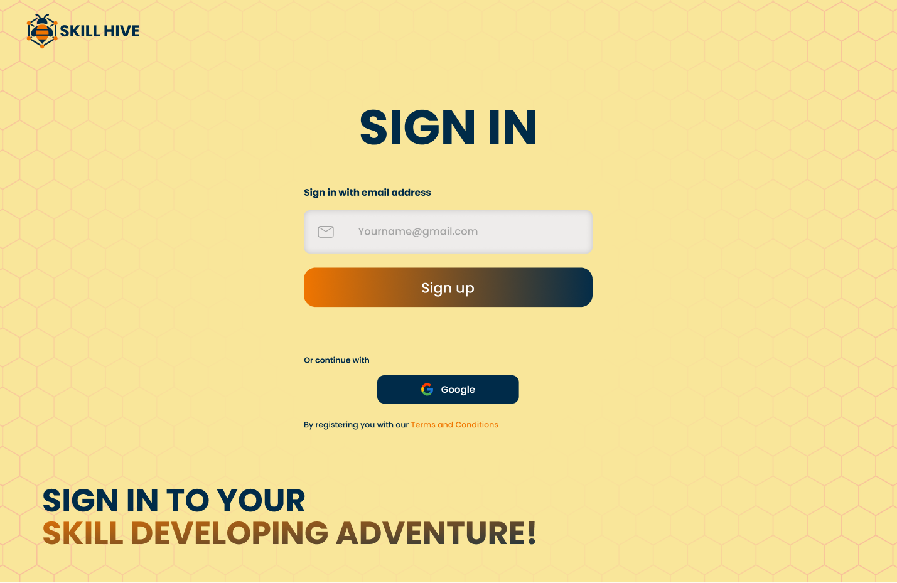
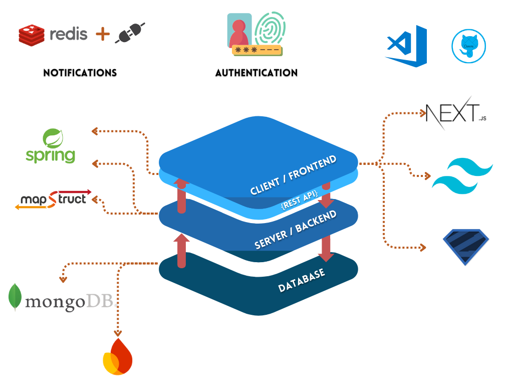
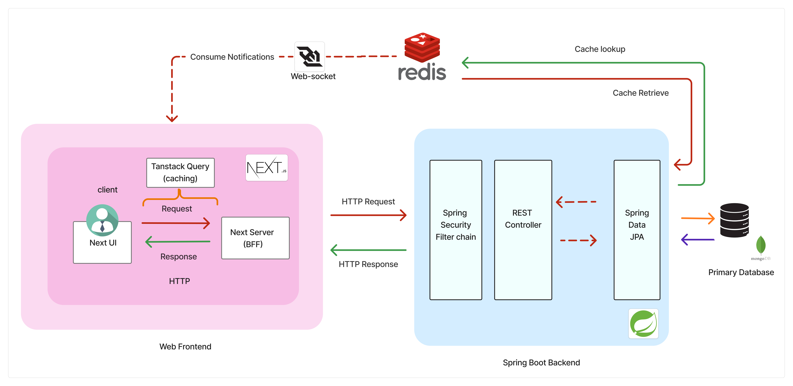

# 🚀 SkillHive

_Built a full-stack web app designed to empower users to learn and teach new skills through structured roadmaps, community engagement, and real-time interactions._

> Think **Skillshare + Notion + LinkedIn** but made for next-gen learners and creators. 🌱🚀

---

## 👩‍💻 My Role & Learnings
**Full-Stack Developer · Product Designer · Data Architect · Team Leader**

- Architected both frontend and backend from the ground up  
- Led the team in feature planning, task delegation, and collaborative coding  
- Mastered REST API design and real-time interaction logic  
- Balanced clean, scalable code with intuitive, user-centered design  
- Gained deep insight into scalable architecture and auth workflows 
---

## 🚀 Key Highlights

- 📚 **Learning Roadmaps**: Structured skill paths with progress tracking  
- 👥 **Community-Driven**: Endorsements, reviews, and shared resources  
- 🧑‍🏫 **Role-Based Access**: Tailored user flows for learners, contributors, and admins  
- 🔐 **Seamless Auth**: Social login via Clerk + secure backend JWT  
- 🔔 **Real-Time Notifications**: Live alerts for comments, feedback, and updates  
- 💬 **Social Features**: Follows, upvotes, and comments to foster engagement   

---

## 🌟 Impact

**SkillHive** supports both **self-paced learning** and **collaborative growth**, fostering an open-learning culture driven by **community-powered content** and meaningful **peer interaction**.

---

## 📸 Screenshots

### 🔹 Landing Page  


### 🔹 Tech Stack  


- **Frontend**: React, Tailwind CSS, Clerk Authentication  
- **Backend**: Spring Boot, MongoDB, JWT  
- **Infrastructure**: REST APIs, Modular Architecture, Real-Time UX Components  

### 🔹 Auth Flow  


---

## 🛠️ Getting Started

Wanna run SkillHive locally and see the magic for yourself? Here's how you can set it up like a pro 👇

### 🔃 1. Clone the Repository

```bash
git clone https://github.com/your-username/skillhive.git
cd skillhive
```
### 🌐 2. Frontend Setup (React + Clerk)
```bash
cd frontend
npm install
```

👉 Environment Setup (.env)
Create a .env file in the frontend folder and add your Clerk keys:
```env
VITE_CLERK_PUBLISHABLE_KEY=your-clerk-pub-key
VITE_BACKEND_URL=http://localhost:8080
```

Then run the dev server:

```bash
npm run dev
```
App will be live at: http://localhost:5173

### ⚙️ 3. Backend Setup (Spring Boot + MongoDB)
```bash
cd ../backend
./mvnw clean install
```

👉 Configure PostgreSQL DB
Update your application.properties or application.yml with your DB credentials:

```properties
spring.datasource.url=jdbc:postgresql://localhost:5432/skillhive
spring.datasource.username=your_username
spring.datasource.password=your_password
```
Then run the backend:

```bash
./mvnw spring-boot:run
```
API will be available at: http://localhost:8080/api

## 📦 API Overview
- Auth: /api/auth/login, /api/auth/register
- Users: /api/users, /api/users/{id}
- Roadmaps: /api/roadmaps, /api/roadmaps/{id}
- Comments/Interactions: /api/comments, /api/notifications

You can explore the full API using Postman or Swagger if configured.

### 🧪 4. Optional: Test Your Setup
Sign up using Clerk (Google/GitHub)
Create a roadmap
Interact with comments & follow users
Check notifications in real-time 🛎️

## 🤝 Contributing
Pull requests are welcome! If you have ideas, feedback, or bug fixes—open an issue or fork and PR away 🚀

## 📄 License
MIT — feel free to use, remix, and build your own SkillHive ✨
